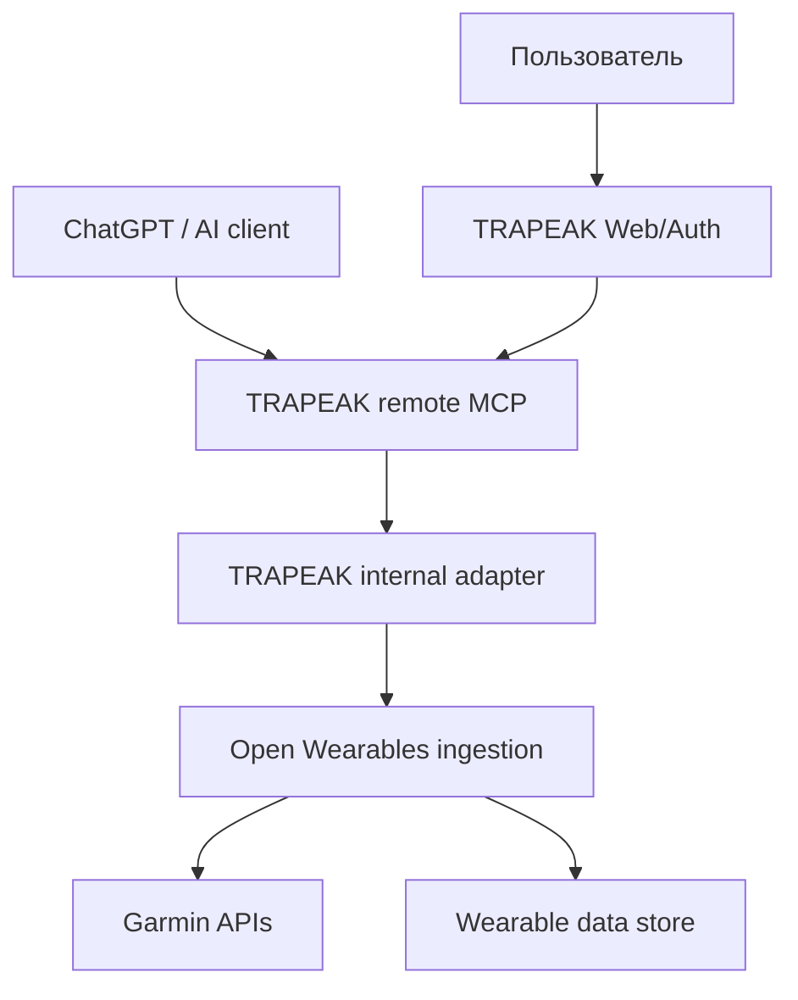

# ADR-0001: частичное использование Open Wearables

- Статус: принято для PoC; production-использование зависит от выполнения обязательных мер безопасности
- Дата: 2026-08-12
- Решение: `partial reuse`
- Проверенная ревизия Open Wearables: [`31a89b9`](https://github.com/the-momentum/open-wearables/tree/31a89b902baa5d21bc419fa0f80bb4586f641157)

## Контекст

TRAPEAK должен получать данные Garmin и предоставлять их конкретному владельцу через удалённый read-only MCP для ChatGPT и других AI-клиентов. Open Wearables уже решает значительную часть задачи интеграции с wearable-провайдерами, но спроектирован как self-hosted платформа одной организации, а не как пользовательский контур авторизации TRAPEAK.

Проверены лицензия, активность проекта, Garmin OAuth и ingestion pipeline, backfill/retry, модель данных, API/MCP, хранение секретов, тесты и операционная сложность.

## Результат аудита

| Область | Вывод |
|---|---|
| Лицензия | MIT разрешает коммерческое использование, модификацию и распространение при сохранении copyright notice и текста лицензии. |
| Зрелость | Проект активен: версия 0.6.3, регулярные релизы, CI, миграции и заметный набор backend-тестов. API остаётся pre-1.0, поэтому breaking changes вероятны. |
| Garmin | Реализованы OAuth 2.0 + PKCE, одноразовый state в Redis, refresh/revoke, push-webhooks, 30-дневный historical backfill, таймауты и retry-state machine. Это наиболее ценный слой для повторного использования. |
| Идемпотентность | Дубликаты частично предотвращаются индексами БД и обработкой unique violations. Для TRAPEAK нужны отдельные e2e-тесты повторной доставки одинакового webhook. |
| Модель данных | Есть нормализованные workout/event/timeseries модели и привязка к пользователю и источнику. Модель шире MVP TRAPEAK и не должна становиться публичным контрактом TRAPEAK. |
| Изоляция пользователей | Текущие API-ключи глобальные. API key хранится как значение primary key, а маршруты users/workouts проверяют только наличие ключа и не ограничивают его одним пользователем. Такой API нельзя выдавать MCP-клиенту. |
| MCP | Upstream MCP запускается локально через stdio, использует один статический API key и предлагает модели перечислять пользователей через `get_users`. Он не реализует удалённый пользовательский OAuth-контур TRAPEAK и не подходит для ChatGPT без переработки. |
| Provider tokens | `access_token` и `refresh_token` в `UserConnection` сохраняются обычными строками. Fernet в проекте используется для конфигурации, но шифрование provider tokens на уровне БД не реализовано. |
| Garmin webhook | Проверяется только наличие заголовка `garmin-client-id`, но не его значение. Это позволяет подделывать payload при знании Garmin user id; проблема также зафиксирована в открытом upstream issue #1380. |
| Эксплуатация | Полный stack включает FastAPI, PostgreSQL, Redis, Celery worker/beat, frontend, Flower и опционально Svix/S3. Для MVP это тяжелее собственного Next.js backend, но ingestion-часть может работать отдельно без frontend, Flower, Svix и upstream MCP. |
| Тесты | Есть CI, lint/type checks, 162 backend test-файла и отдельные Garmin-тесты. MCP-тесты пока существенно меньше backend-набора. |

## Рассмотренные варианты

### 1. Adopt — взять всю платформу

Отклонено. Это перенесло бы в TRAPEAK несовместимую модель глобальных API-ключей, локальный stdio MCP, plaintext provider tokens, лишний frontend и лишние сервисы. Цена исправления границ доступа слишком высока, чтобы считать решение готовым `adopt`.

### 2. Partial reuse — закрытый ingestion backend

Принято. Open Wearables используется только как внутренний сервис подключения провайдеров, получения данных и нормализации. Он не является публичной системой авторизации или MCP TRAPEAK.

### 3. Do not adopt — полностью собственная интеграция

Не выбрано на текущем этапе. Собственная реализация была бы проще операционно, но повторила бы уже реализованные OAuth, webhook, backfill, retry и normalization механизмы и замедлила бы добавление Polar, Suunto и других источников.

## Архитектурная граница

Правила:

- внешний клиент никогда не обращается к Open Wearables напрямую;
- TRAPEAK устанавливает пользователя из своей сессии/OAuth access token, а не принимает произвольный `user_id` как границу авторизации;
- Open Wearables доступен только во внутренней сети по service-to-service credential;
- соответствие `trapeak_user_id ↔ open_wearables_user_id` хранится в TRAPEAK;
- публичный MCP реализуется в TRAPEAK как stable HTTPS endpoint со streaming HTTP и OAuth 2.1;
- TRAPEAK определяет собственные стабильные MCP schemas и не раскрывает upstream API как публичный контракт.

## Что переиспользуем

- Garmin OAuth/PKCE и token refresh/revoke логику;
- Garmin push webhook parsing;
- historical backfill, timeout и retry orchestration;
- нормализацию workout/event/timeseries;
- deduplication primitives и provider adapters;
- provider contract как основу для будущих Polar/Suunto интеграций.

## Что не используем

- upstream frontend и developer portal как пользовательский интерфейс TRAPEAK;
- upstream developer auth, SDK invitation/refresh-token flows;
- глобальные API keys как пользовательскую авторизацию;
- upstream MCP server и tool contracts;
- AI assistant/automations;
- Svix, Flower, SDK/mobile и health-модули, пока они не нужны MVP.

## Обязательные изменения до работы с реальными пользователями

1. Зашифровать provider access/refresh tokens на уровне приложения; ключ хранить отдельно от БД, предусмотреть rotation.
2. Исправить Garmin webhook gate: fail closed, сверять ожидаемый client id и добавить дополнительную защиту callback URL/ingress, доступную по условиям Garmin.
3. Не публиковать Open Wearables API, PostgreSQL и Redis в интернет.
4. Хранить service credential в secret manager, не выдавать его браузеру, ChatGPT или пользователю.
5. Добавить authorization wrapper, который всегда связывает запрос с одним `trapeak_user_id`.
6. Исключить из deployment неиспользуемые auth/SDK/admin маршруты либо закрыть их сетевым policy.
7. Зафиксировать upstream по точному commit SHA в собственном fork и обновлять только после regression/security review.
8. Включить хранение исходных Garmin payload/FIT в контролируемом хранилище, если это разрешено условиями Garmin, чтобы сохранить возможность миграции.

## PoC и критерии продолжения

PoC выполняется на fork, зафиксированном по точному SHA, с mock Garmin до получения credentials. Решение считается подтверждённым, если:

- пользователь TRAPEAK подключается через Garmin OAuth и связь создаётся ровно для его профиля;
- импортируется историческая и новая тренировка;
- повторная доставка одного события не создаёт дубликат;
- временный сбой worker/API корректно повторяется и виден в статусе;
- provider tokens не читаются из БД в открытом виде;
- поддельный webhook отклоняется;
- пользователь A не может получить данные пользователя B ни через REST, ни через MCP;
- MCP tool не принимает свободный `user_id` и работает от авторизованной identity;
- disconnect и удаление аккаунта приводят к ожидаемому revoke/delete;
- Open Wearables можно отключить, сохранив raw data и mapping для миграции.

Если хотя бы изоляция пользователей, шифрование tokens или remote MCP auth требуют глубокого переписывания ingestion core, решение пересматривается в пользу `do not adopt`.

## Последствия

Плюсы:

- существенно меньше собственного кода вокруг Garmin и будущих wearable-провайдеров;
- сохраняется независимый и безопасный MCP-контур TRAPEAK;
- Open Wearables можно обновлять или заменить без изменения публичных MCP schemas.

Минусы:

- появляются Python/FastAPI, Redis и Celery рядом с Next.js;
- нужен собственный fork и регулярный просмотр upstream security/compatibility changes;
- данные и идентификаторы проходят через дополнительный внутренний адаптер.

## План отката

TRAPEAK не связывает публичные schemas с таблицами Open Wearables. При отказе от компонента внутренний adapter заменяется собственной ingestion-реализацией, mapping переносится, а сохранённые raw payload/FIT повторно нормализуются в схему TRAPEAK.

## Проверенные источники

- [Open Wearables README](https://github.com/the-momentum/open-wearables/blob/31a89b902baa5d21bc419fa0f80bb4586f641157/README.md)
- [MIT License](https://github.com/the-momentum/open-wearables/blob/31a89b902baa5d21bc419fa0f80bb4586f641157/LICENSE)
- [Garmin OAuth](https://github.com/the-momentum/open-wearables/blob/31a89b902baa5d21bc419fa0f80bb4586f641157/backend/app/services/providers/garmin/oauth.py)
- [Garmin webhook handler](https://github.com/the-momentum/open-wearables/blob/31a89b902baa5d21bc419fa0f80bb4586f641157/backend/app/services/providers/garmin/webhook_handler.py)
- [Global API key model](https://github.com/the-momentum/open-wearables/blob/31a89b902baa5d21bc419fa0f80bb4586f641157/backend/app/models/api_key.py)
- [User API authorization](https://github.com/the-momentum/open-wearables/blob/31a89b902baa5d21bc419fa0f80bb4586f641157/backend/app/api/routes/v1/users.py)
- [Provider token model](https://github.com/the-momentum/open-wearables/blob/31a89b902baa5d21bc419fa0f80bb4586f641157/backend/app/models/user_connection.py)
- [Upstream MCP README](https://github.com/the-momentum/open-wearables/blob/31a89b902baa5d21bc419fa0f80bb4586f641157/mcp/README.md)
- [Open webhook security report #1380](https://github.com/the-momentum/open-wearables/issues/1380)
- [OpenAI: ChatGPT Developer mode](https://developers.openai.com/api/docs/guides/developer-mode)
- [OpenAI: OAuth 2.1 for authenticated MCP](https://developers.openai.com/plugins/build/auth)
