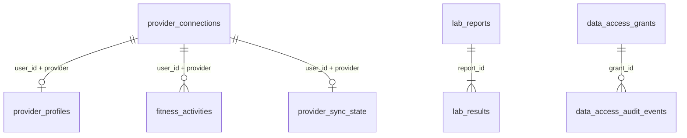

# База данных: таблицы и источники

Этот документ описывает фактическую PostgreSQL-схему TRAPEAK: для чего нужна каждая таблица, кто её заполняет и где данные используются. Источником истины для структуры остаются versioned migrations в `db/migrations/`.

## Общие правила

- Пользователь аутентифицируется через Clerk. Отдельной таблицы `users` в TRAPEAK нет; проверенный Clerk `userId` сохраняется как `user_id`.
- Все пользовательские чтения и изменения ограничиваются `user_id`. Для `lab_results` владелец определяется через связанный `lab_reports`.
- Данные wearable нормализуются в общие поля, а исходный provider payload хранится отдельно и не возвращается через MCP.
- AI сохраняет данные только после явной команды пользователя. Оценённое питание помечается `estimated` и содержит допущения.
- OAuth-токены хранятся только в зашифрованном виде.

`nutrition_entries`, `user_profiles`, `weight_entries` и provider-таблицы связаны одним проверенным `user_id`, но намеренно не имеют внешнего ключа на Clerk.

## Краткий каталог

| Таблица | Назначение | Активный источник |
|---|---|---|
| `schema_migrations` | Учёт применённых SQL migrations | migration runner |
| `provider_connections` | OAuth-подключение wearable-провайдера | Wahoo OAuth |
| `provider_profiles` | Последний нормализованный профиль провайдера | Wahoo Cloud API sync |
| `fitness_activities` | Нормализованные завершённые тренировки | Wahoo API sync и webhook |
| `provider_sync_state` | Состояние последней синхронизации | TRAPEAK ingestion service |
| `nutrition_entries` | Датированный журнал приёмов пищи и КБЖУ | AI через MCP; dashboard manual |
| `lab_reports` | Заголовок датированного лабораторного отчёта | AI через MCP |
| `lab_results` | Показатели внутри лабораторного отчёта | AI через MCP вместе с отчётом |
| `user_profiles` | Долгоживущий профиль целей и ограничений | AI onboarding через MCP |
| `weight_entries` | История точных измерений веса | AI через MCP; Profile v1 migration |
| `data_access_grants` | Временный read-only доступ по email и категориям | Shared access dashboard |
| `data_access_audit_events` | Журнал создания, принятия, чтения и отзыва grants | TRAPEAK server |

## Системная таблица

### `schema_migrations`

- **Назначение:** не допускать повторного применения migration-файлов.
- **Заполняется:** `scripts/migrate.mjs` после успешного выполнения транзакции.
- **Основные поля:** имя migration в `id`, время применения в `applied_at`.
- **Пользовательские данные:** отсутствуют.

## Wearable и тренировки

### `provider_connections`

- **Назначение:** состояние OAuth-подключения пользователя к одному wearable-провайдеру.
- **Активный источник:** Wahoo OAuth callback, refresh, disconnect и обработка ошибок. Значения `garmin` и `suunto` зарезервированы общей provider-моделью, но production ingestion для них ещё не включён.
- **Хранит:** provider account ID, отображаемое имя, status, scopes, срок токена, зашифрованные access/refresh tokens и последний error code.
- **Используется:** server-side provider adapter, dashboard connection status, ручная синхронизация и webhook ownership resolution.
- **Ключи:** один provider на пользователя; один provider account нельзя одновременно привязать к двум TRAPEAK accounts.
- **Удаление:** удаление connection каскадно удаляет связанные provider profile, activities и sync state.

### `provider_profiles`

- **Назначение:** последняя нормализованная копия athlete profile, полученного от provider.
- **Активный источник:** Wahoo Cloud API во время полной синхронизации.
- **Хранит:** display name, рост, provider weight, дату рождения, gender code, provider timestamps, `raw_payload` и время sync.
- **Используется:** `get_athlete_profile` и `get_training_context`.
- **Важно:** это provider snapshot, а не custom Profile. Provider weight не заменяет `weight_entries`; MCP не возвращает `raw_payload`.
- **Ключ:** одна актуальная запись на `(user_id, provider)`.

### `fitness_activities`

- **Назначение:** единая история завершённых тренировок.
- **Активные источники:** Wahoo Cloud API при ручном sync и Wahoo workout summary webhook для новых тренировок.
- **Хранит:** время, тип, длительность, дистанцию, набор нормализованных сводных метрик, provider timestamps, `raw_payload` и sync timestamps.
- **Используется:** `list_activities`, `get_activity`, dashboard и `get_training_context` с окнами нагрузки 7/14/14–56 дней.
- **Идемпотентность:** unique `(user_id, provider, provider_activity_id)`; повторный sync обновляет запись.
- **Граница:** planned workouts без completed workout summary не считаются тренировками.

### `provider_sync_state`

- **Назначение:** операционное состояние ingestion для каждой пары пользователь/provider.
- **Заполняется:** TRAPEAK после полной синхронизации, webhook ingestion или ошибки.
- **Хранит:** последнее время sync, provider total, число обработанных записей и последний error code.
- **Используется:** dashboard и диагностика sync; это не пользовательская health-метрика.
- **Ключ:** `(user_id, provider)`.

## Пользовательские записи

### `nutrition_entries`

- **Назначение:** один датированный приём пищи с описанием и итоговыми КБЖУ.
- **Активные источники:** `create_nutrition_entry` через AI/MCP; ручная форма dashboard. Фото или текст разбирает выбранный AI-клиент, а TRAPEAK получает готовую структуру.
- **Хранит:** время, meal type, полное описание, calories/protein/carbohydrates/fat, notes, `estimated`, estimation notes и source.
- **Используется:** список питания, дневные итоги, dashboard и последние 7 дней в `get_training_context`.
- **Идемпотентность:** AI-записи используют unique `(user_id, idempotency_key)`; manual-записи могут иметь `NULL` key.
- **Legacy:** `title` остаётся коротким совместимым заголовком, каноническое описание находится в `description`.

### `lab_reports`

- **Назначение:** метаданные одного датированного лабораторного исследования.
- **Активный источник:** `create_lab_report` через AI/MCP после явной команды пользователя. PDF читает AI-клиент; TRAPEAK не выполняет собственный OCR и не хранит файл.
- **Хранит:** collection time, тип образца/исследования, title, laboratory, notes, source и idempotency key.
- **Используется:** `list_lab_reports`, `get_lab_report`, dashboard deletion и связь с показателями.
- **Идемпотентность:** unique `(user_id, idempotency_key)` по содержимому отчёта.
- **Удаление:** удаление отчёта каскадно удаляет его `lab_results`.

### `lab_results`

- **Назначение:** отдельный показатель внутри `lab_reports`.
- **Активный источник:** создаётся атомарно вместе с AI laboratory report.
- **Хранит:** название аналита, исходное текстовое и необязательное числовое значение, единицу, референсы и laboratory flag.
- **Используется:** полный отчёт и `get_lab_result_history` по точному названию без учёта регистра.
- **Ownership:** определяется через `report_id`; прямого `user_id` нет.
- **Важно:** исходные единицы и референсы сохраняются без диагностики и без сравнения несовместимых единиц.

### `user_profiles`

- **Назначение:** независимый от provider и AI-провайдера долгоживущий Profile.
- **Активный источник:** `update_user_profile` во время onboarding и последующих явных обновлений через AI/MCP.
- **Хранит в `profile` JSONB:** дату рождения, пол, рост, time zone, цели, тренировочный опыт и предпочтения, травмы, health conditions, противопоказания, препараты, ограничения питания, nutrition notes, `workActivityContext`, доступность по дням, оборудование и интервал напоминания о весе.
- **`workActivityContext`:** только контекст, который часы не определяют надёжно: преимущественно сидячая/стоячая/физическая работа, смены или ночной график.
- **Не хранит:** фиксированный возраст, текущий вес, ручные сон, дневную активность, stress level, кофеин и алкоголь.
- **`field_statuses`:** явные `not_applicable` и `prefer_not_to_answer`, чтобы AI не повторял вопрос.
- **Используется:** `get_user_profile`, progressive completeness и `get_training_context`.
- **Версия:** migration `0009` переводит Profile в version 3 и переносит legacy `workPattern` в `workActivityContext`.

### `weight_entries`

- **Назначение:** отдельные датированные измерения веса для истории и графиков.
- **Активные источники:** `create_weight_entry` через AI/MCP и migration старого `weightKilograms` из Profile v1. Значения source `manual` и `provider` зарезервированы для будущих write paths.
- **Хранит:** measurement time, kilograms, notes, source и idempotency key.
- **Используется:** `list_weight_entries`, Profile completeness, изменения за 7/30/90 дней, reminder status и `get_training_context`.
- **Идемпотентность:** unique `(user_id, idempotency_key)`; идентичная повторная отправка возвращает существующий ID.
- **Удаление:** конкретная точка удаляется только с явным подтверждением; удаление custom Profile историю веса не затрагивает.

## Делегированный доступ

### `data_access_grants`

- **Назначение:** связывает владельца и получателя временным read-only разрешением без ролей.
- **Выдача:** владелец указывает email, срок и одну или несколько текущих категорий: `training`, `nutrition`, `health`. Значение `recovery` остаётся зарезервированным в схеме до появления датированного источника и не предлагается при создании новых grants.
- **Принятие:** в базе хранится только SHA-256 hash invitation token; принять или отклонить приглашение может вошедший пользователь с тем же primary email.
- **Проверка:** каждый shared read требует active status, непросроченный grant, совпадающий Clerk recipient ID и нужную категорию.
- **Отзыв:** владелец может отозвать pending или active grant немедленно.

### `data_access_audit_events`

- **Назначение:** append-only журнал создания, принятия, отклонения, отзыва и чтения shared data.
- **Хранит:** grant, actor, действие, категорию, тип ресурса, OAuth client ID и время.
- **Ownership:** владелец видит только события grants, где `owner_user_id` совпадает с его Clerk ID.

## Динамические health-метрики: ещё не хранятся

Для сна, общей дневной активности, provider stress, HRV, readiness и recovery пока нет таблиц и активного ingestion. Эти значения должны поступать из поддерживаемого wearable API как датированные измерения, а не из постоянных полей Profile и не из AI-догадок.

До подключения источника `get_training_context` возвращает:

- `sleepAvailable: false`;
- `dailyActivityAvailable: false`;
- `stressAvailable: false`;
- `recoveryAvailable: false`.

Когда появится provider с нужными разрешениями и полями, схема health metrics будет добавлена отдельной migration с описанием provider mapping, единиц, временной зоны и стратегии дедупликации.
