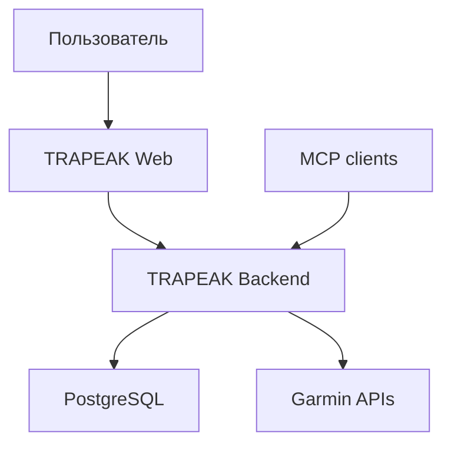

# Архитектура: обзор

## Контекст

TRAPEAK — серверное web-приложение. Браузер не обращается к Garmin API напрямую и не получает Garmin credentials или пользовательские токены.

## Архитектурные ограничения первого этапа

- один пользователь TRAPEAK может иметь не более одного активного Garmin-подключения;
- Garmin вызывается только backend-компонентом;
- доменная модель TRAPEAK не должна зависеть от названий полей Garmin;
- интеграция Garmin изолируется adapter/service-слоем;
- секреты не попадают в Git, URL, frontend state и логи;
- все пользовательские запросы проверяют владельца ресурса;
- реальные вызовы Garmin заменяются mock/fake в автоматических тестах.

Технологический стек фиксируется в ADR до реализации. Предварительный вариант: TypeScript, Next.js, PostgreSQL и Auth.js, но это не считается принятым решением до завершения TRP-001.

