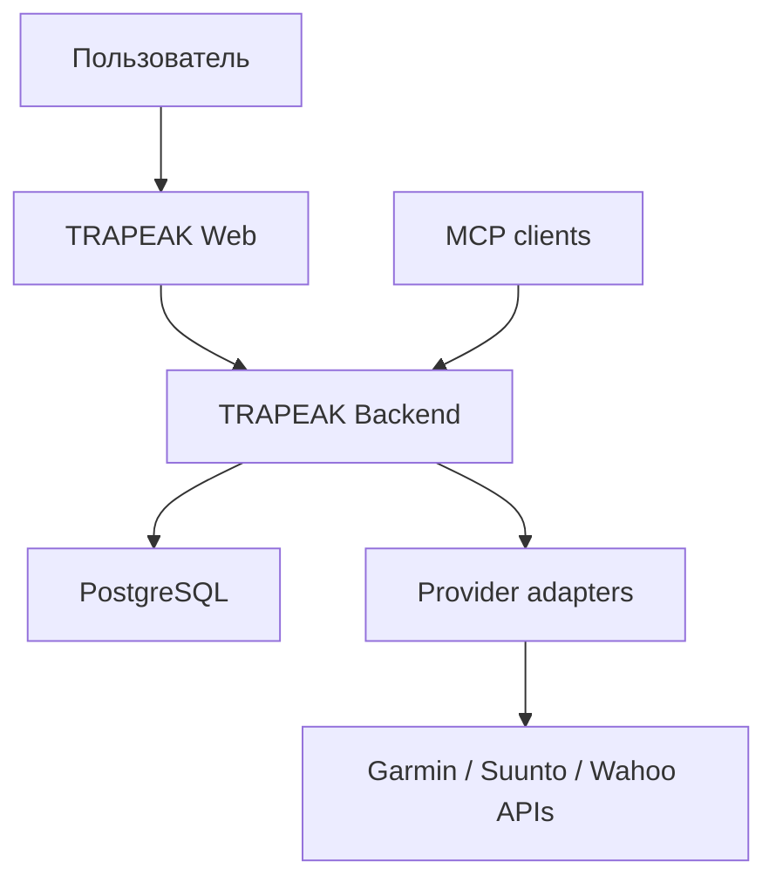

# Архитектура: обзор

## Контекст

TRAPEAK — серверное web-приложение. Браузер не обращается к API фитнес-провайдеров напрямую и не получает credentials или пользовательские токены провайдеров.

## Архитектурные ограничения первого этапа

- один пользователь TRAPEAK может иметь не более одного активного подключения каждого провайдера;
- API провайдеров вызываются только backend-компонентами;
- доменная модель TRAPEAK не зависит от названий полей конкретного провайдера;
- Garmin, Suunto и Wahoo изолируются единым adapter/service-контрактом;
- секреты не попадают в Git, URL, frontend state и логи;
- все пользовательские запросы проверяют владельца ресурса;
- реальные вызовы провайдеров заменяются mock/fake в автоматических тестах.

Пользовательская identity и сессии реализуются через Clerk. Доменный код получает только внутренний `AuthUser` и не импортирует Clerk. Реальные provider adapters добавляются после выдачи credentials; registry по умолчанию пуст и закрывается ошибкой для ненастроенного провайдера.
